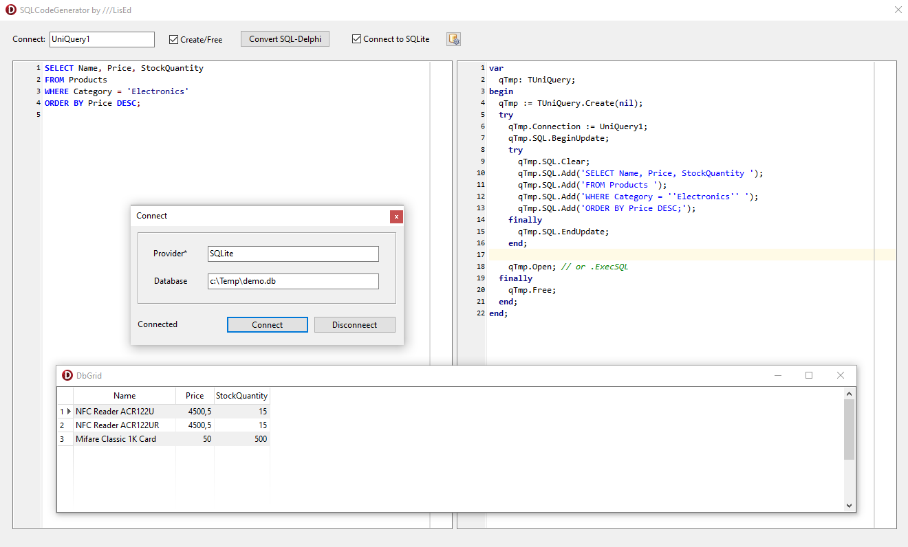

# SQL-to-Delphi Code Generator (Pro Edition) 🚀

Инструмент разработчика для мгновенного превращения SQL-запросов в оптимизированный код на Object Pascal (Delphi). Идеально подходит для тех, кто работает с UniDAC и хочет избавиться от рутины.

  

## ✨ Ключевые особенности

- **Smart Code Generation**: Превращает сырой SQL в аккуратный блок кода `TUniQuery` с поддержкой `BeginUpdate/EndUpdate`.
- **Интеллектуальный поиск параметров**: Автоматически находит переменные (например, `:ID`, `:DateStart`) и генерирует строки `ParamByName().Value := ...`.
- **Live SQLite Tester**: Интегрированная возможность подключения к базам SQLite. Пишите запрос и проверяйте его результат в реальном времени прямо в утилите.
- **Два режима генерации**:
  - _Существующий компонент_: Код для уже лежащего на форме `TUniQuery`.
  - _Временный объект_: Полный автономный блок `var qTmp: TUniQuery ... try..finally` с автоматическим созданием и очисткой памяти.
- **Профессиональная подсветка**: Использование SynEdit для SQL (диалекты SQLite, MySQL, PostgreSQL) и Object Pascal.

## 🛠 Технологический стек

- **IDE**: Delphi 11 Alexandria.
- **Компоненты доступа**: [Devart UniDAC](https://www.devart.com/unidac/) (провайдер SQLite).
- **Редактор кода**: [SynEdit](https://github.com/SynEdit/SynEdit).

## 🚀 Быстрый старт

1. **Генерация кода**:

   - Вставьте ваш SQL в левое окно.
   - Укажите имя вашего `UniConnection` или `UniQuery`.
   - Нажмите **Generate** — готовый код уже в вашем буфере обмена!

2. **Тестирование SQLite**:
   - Нажмите кнопку подключения к БД.
   - Выберите файл `.db` или `.sqlite`.
   - Выполняйте запросы и просматривайте результат в таблице перед тем, как вставить их в проект.

## 📄 Лицензия

Проект распространяется под лицензией MIT. Полные исходные коды доступны для изучения и модернизации.

---

## ☕ Поддержка / Support

Если эта утилита сэкономила вам время, вы можете поддержать автора:

👉 [**Поддержать на Boosty (RU/International Cards)**](https://boosty.to/lised/donate)

Разработано с ❤️ для Delphi-сообщества.
